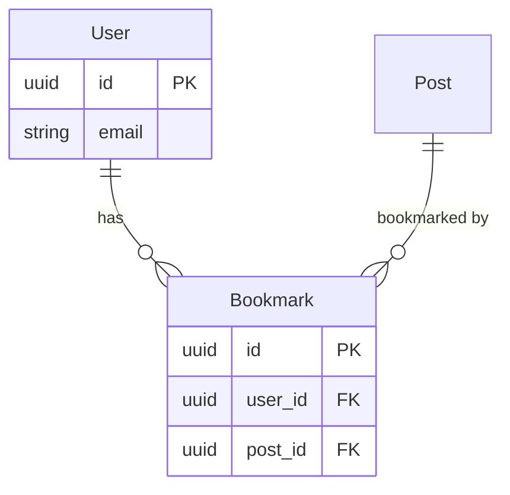

# Examples, by skill — real prompts

Every skill below gets two kinds of example: **typical use** (the
straightforward, common case — what most invocations actually look like)
and **edge cases** (the non-obvious behaviors from each skill's "Things
to not do" list, turned into literal prompts you could paste into Claude
Code, exact input, and actual expected output, so the handling is
checkable rather than just asserted). Organized in the same order as the
pipelines in [`PIPELINES.md`](PIPELINES.md).

## `requirement-gap-analysis`

**Typical use.**

> Prompt: `what am I missing before I design this?` + pasted:
> ```
> Epic: Team Workspaces
> - Users can create a "workspace" and invite other users to it
> - Workspace members can share documents within the workspace
> - Workspace owner can remove members
> - Ship by end of Q3
> ```

Expected `GAP_ANALYSIS.md` excerpt:
```
## Functional
- **Should-Fix**: What happens to a workspace's documents when the owner
  removes a member who uploaded them — do they stay, get reassigned, or
  get removed? Not stated.
- **Should-Fix**: Can a workspace have more than one owner, or is
  ownership transferable? Not stated, and it affects the data model.

## Stakeholders
- **Nice-to-Have**: Any limit on workspace size (member count, document
  count)? Worth asking before this becomes a capacity/cost question later.
```

**Edge case: input is already a solution, not a pre-design brief.**

> Prompt: `Can you do a gap analysis on this doc?` (pasting a file that
> starts with `# Design: Rate Limiting via Token Bucket` and has a
> `## Solution` section describing a token-bucket algorithm and API shape)

Expected response, before anything else:
```
This reads as a proposed solution (it has a Solution section describing
a specific implementation approach), not pre-design input — gap analysis
is meant to run before a solution exists. Did you want `rfc-review`
instead, since that's built for reviewing a proposal like this one?
```

**Edge case: compliance category with no basis.**

> Prompt: `what am I missing before I build this` + pasted text:
> `We want users to be able to export their data. Add an export button to
> the account settings page.`

Expected `GAP_ANALYSIS.md` excerpt:
```
## Compliance/Regulatory
Skipped — nothing in this input suggests a specific regulatory angle
(no mention of personal data categories, jurisdiction, or industry).
If this data includes anything beyond basic account info, revisit this
category once that's known.
```

**Edge case: no template, deliberately.**

> Prompt: `gap analysis on this epic` + pasted:
> ```
> Epic: Team Workspaces
> - Users can create a "workspace" and invite other users to it
> - Workspace members can share documents within the workspace
> - Workspace owner can remove members
> - Ship by end of Q3
> ```

Expected: the report runs directly on the bullets — no note like "this
doc is missing standard sections," because bullet lists are a fully
valid input shape here, not a defect to flag.

## `rfc-review`

**Typical use.**

> Prompt: `review this RFC` + pasting a well-structured bookmarks-feature
> RFC (Summary, Goals, Design, Data Model, Rollout sections all present).

Expected `RFC_REVIEW.md` excerpt:
```
## Verdict: Ready to Approve

## Findings
- **Nice-to-Have**: The idempotent-bookmarking requirement ("a user can
  only bookmark a post once") implies a uniqueness constraint that's
  stated in prose but not called out as an explicit data-model
  requirement. Worth making explicit for whoever implements the schema.

## Detected template and section map
Template: RFC. All core sections present (Summary, Goals, Non-Goals,
Design, Data Model, Rollout).
```

**Edge case: non-proposal doc.**

> Prompt: `review this RFC` + pasting a file that's actually a
> `postmortem.md` (Summary / Timeline / Root Cause / Action Items).

Expected response:
```
This doesn't read as forward-looking design/decision content — it looks
like a postmortem (Timeline, Root Cause, Action Items sections). Did you
actually want an RFC-style review applied here, or were you looking for
something else?
```

**Edge case: hedge words that are actually fine.**

> Prompt: `review this RFC for ambiguity` on a doc whose "Alternatives
> Considered" section reads: *"We might have used a message queue instead
> of polling, but rejected it for operational complexity."*

Expected: this "might" is **not** listed as an Ambiguity finding — the
pre-pass's `vague_language_candidates` flags it as a candidate, but the
finding write-up says something like:
```
"might" appears only in the rejected-alternatives discussion, not in the
design's actual guarantees — not a real ambiguity, no finding raised.
```

**Edge case: diagram-heavy RFC.**

> Prompt: `review this RFC` on a doc whose Design section is just: *"See
> the attached sequence diagram for the retry flow."* with an embedded
> image reference and no further prose.

Expected `RFC_REVIEW.md` excerpt:
```
### Diagrams not analyzed
- Design section, retry-flow sequence diagram — referenced but not
  analyzed (this reviewer only reads text). Verify manually that the
  retry flow it describes actually covers the failure modes below.
```

**Edge case: external doc link.**

> Prompt: `review this: https://docs.google.com/document/d/abc123/edit`

Expected response:
```
I can't reliably fetch content from Google Docs links (they usually
return a login wall or an unusable JS shell). Could you paste the doc's
text directly, or export it to a markdown/text file?
```

## `rfc-to-schema`

**Typical use.**

> Prompt: `generate the schema for this RFC` on the same bookmarks RFC.

Expected `schema.sql` excerpt:
```sql
CREATE TABLE bookmarks (
  id UUID PRIMARY KEY,  -- ASSUMED: standard primary key convention
  user_id UUID NOT NULL REFERENCES users(id),
  post_id UUID NOT NULL REFERENCES posts(id),
  created_at TIMESTAMPTZ NOT NULL DEFAULT now()  -- ASSUMED: standard audit field
);
```
Plus `SCHEMA_NOTES.md` listing every `ASSUMED` field and why, and
`schema.ir.json` for downstream skills to consume.

**Edge case: same RFC, re-run after a small edit.**

> Prompt: `regenerate the schema, I fixed a typo in the RFC` — run inside
> `jobs/bookmarks-rfc.md`'s directory, which already has a
> `jobs/schema.ir.json` and `jobs/SCHEMA_NOTES.md` from a prior run.

Expected: **no** "entity already exists" collision warning. `SCHEMA_NOTES.md`'s
recorded source matches the current RFC's path/title, so this is treated
as a regeneration:
```
Regenerating schema.ir.json for jobs/bookmarks-rfc.md (previously
generated schema found for the same RFC — updating, not colliding).
```

**Edge case: genuinely different RFC, same entity name.**

> Prompt: `generate the schema for this RFC` on `jobs/blog-posts-rfc.md`,
> in a directory where an unrelated `jobs/schema.ir.json` from a
> different, already-shipped feature happens to define its own `Post`
> entity.

Expected: this **is** flagged, because the recorded source doesn't match:
```
Warning: schema.ir.json already exists in this directory and defines a
`Post` entity, but its recorded source doesn't match this RFC
(jobs/blog-posts-rfc.md). This looks like a real collision with an
unrelated schema, not a re-run — confirm before overwriting.
```

**Edge case: composite uniqueness.**

> Prompt: `generate the schema for this RFC`, where the RFC's Design
> section states: *"A user can only bookmark a given post once —
> bookmarking an already-bookmarked post should be a no-op, not an
> error."*

Expected `schema.sql` excerpt:
```sql
CREATE TABLE bookmarks (
  id UUID PRIMARY KEY,
  user_id UUID NOT NULL REFERENCES users(id),
  post_id UUID NOT NULL REFERENCES posts(id),
  created_at TIMESTAMPTZ NOT NULL DEFAULT now(),
  CONSTRAINT uq_bookmarks_user_id_post_id UNIQUE (user_id, post_id)
);
```

## `rfc-to-api`

**Typical use.**

> Prompt: `generate the API for this RFC` — finds the sibling
> `schema.ir.json` automatically and `$ref`s its entities.

Expected `API_NOTES.md` excerpt:
```
Derived 3 operations from the RFC's described behavior:
- createBookmark  → POST /bookmarks
- listBookmarks   → GET /bookmarks (cursor-paginated)
- deleteBookmark  → DELETE /bookmarks/{id}
Request/response bodies $ref schema.ir.json's Bookmark/User/Post entities
instead of re-guessing field shapes.
```
Plus `openapi.json` and `schema.graphql` rendered from the same IR.

**Edge case: entity only reachable transitively.**

> Prompt: `generate the API for this RFC` — the RFC's operations only
> mention `Bookmark`, but `schema.ir.json`'s `Bookmark` entity has a
> `user_id` field of `type: "ref", ref_entity: "User"`.

Expected `schema.graphql` excerpt — `User` is declared even though no
operation names it directly:
```graphql
type Bookmark {
  id: ID!
  userId: User!
  postId: Post!
  createdAt: DateTime!
}

type User {
  id: ID!
  email: String!
}
```

**Edge case: no `entity` field and no ref anywhere.**

> Prompt: `add a health check operation to the API IR` producing an
> operation like:
> ```json
> {"name": "healthCheck", "kind": "action", "input": {"fields": []}, "output": {"cardinality": "single", "shape": {"fields": []}}}
> ```
> then `render the API`.

Expected `API_NOTES.md` excerpt:
```
- `healthCheck`: no `entity` field and no ref in input/output, so the
  REST path fell back to `POST /healthCheck` — a flat, low-confidence
  guess, not a normal convention-derived path. Consider adding
  `"rest_override": {"path": "/health", "verb": "GET"}` if that's wrong.
```

**Edge case: domain error with no status hint.**

> Prompt: `the RFC also says: "if the user doesn't have enough credits,
> the purchase should fail with a clear error" — regenerate the API`

Expected response before rendering:
```
The RFC describes an `insufficient_credits` error case but doesn't say
what HTTP status it should map to. I need a status_hint for this (e.g.
402 Payment Required) before I can render it — what should it be?
```

## `er-generator`

**Typical use.**

> Prompt: `diagram this schema` pointing at `schema.ir.json`.

Expected `er_diagram.mmd` excerpt:


**Edge case: SQL outside the documented subset.**

> Prompt: `diagram this schema.sql` where the file contains:
> ```sql
> CREATE TABLE events (
>   id UUID PRIMARY KEY,
>   occurred_at TIMESTAMPTZ NOT NULL
> ) PARTITION BY RANGE (occurred_at);
> ```

Expected response:
```
Parsed `events` (id, occurred_at), but skipped the `PARTITION BY RANGE
(occurred_at)` clause — that's outside the documented CREATE TABLE
subset this parser handles. The table and its columns are still in the
diagram; partitioning isn't represented.
```

**Edge case: oversized schema.**

> Prompt: `diagram this database` against a live SQLite file with 80 tables.

Expected response:
```
80 tables is too many for one readable diagram — split into 4 clusters
using connected-components + greedy BFS (a heuristic split, not a real
domain/module boundary — don't treat these clusters as authoritative
service boundaries). Writing er_diagram_1.mmd through er_diagram_4.mmd.
```

**Edge case: live DB connection requested implicitly.**

> Prompt: `diagram my production database`

Expected response:
```
I'd need explicit connection details to reach a live Postgres/MySQL
database — host, port, database name, and credentials (or a connection
string). What are they? Alternatively, point me at a schema.ir.json or a
static schema.sql file instead.
```

## `api-docs`

**Typical use.**

> Prompt: `document this API` pointing at `api.ir.json`.

Expected `API_DOCS.md` excerpt:
```
### `createBookmark`

`POST /bookmarks`

Bookmark a post for the current user. Idempotent — bookmarking an
already-bookmarked post is a no-op, not an error.

**Auth required:** yes

**Request fields**
| Field | Type | Required | Description |
|---|---|---|---|
| `postId` | ref(Post) | yes | The post to bookmark. |

Example:
{ "postId": "3fa85f64-5717-4562-b3fc-2c963f66afa6" }  _(example)_
```

**Edge case: no IR, no spec — only implemented code exists.**

> Prompt: `document our bookmarks API` pointing at a codebase directory
> with real Flask route handlers but no `api.ir.json` and no OpenAPI file.

Expected `API_DOCS.md` intro:
```
# API Reference

Note: no api.ir.json or OpenAPI/GraphQL spec was found for this API —
this reference was reverse-engineered directly from the route handlers
in `app/routes/bookmarks.py`. Treat method/path/field names as read from
code, not as a stated contract; verify against the actual implementation
if precision matters.
```

**Edge case: field with no example-worthy signal.**

> Prompt: `document this API` where a field is just
> `{"name": "metadata", "type": "json", "nullable": true}`.

Expected `API_DOCS.md` field-table row + example:
```
| `metadata` | json | no | Arbitrary structured metadata attached to the record. |

Example:
{
  "metadata": {"source": "import", "tags": ["archived"]}  _(example)_
}
```

**Edge case: low-confidence path in the middle of an otherwise-clean IR.**

> Prompt: `document this API` where every operation resolves cleanly
> except one `archiveBookmark` action-kind op with no `entity` field.

Expected: only that one section carries the caveat —
```
### `archiveBookmark`

`POST /archiveBookmark` _(path derivation: best guess, no entity/ref hint
on this operation — verify)_
```
— while every other operation's heading has no such note.

## `security-review`

**Typical use.**

> Prompt: `review this codebase for security issues` pointing at a
> directory with a genuine SQL-injection bug and a hardcoded AWS key.

Expected `SECURITY_REVIEW.md` excerpt:
```
## Summary
2 Critical, 0 High, 1 Medium, 0 Low

### Critical — SQL injection (routes/search.py:12) — Confidence: High
User-controlled `name` param is concatenated directly into a SQL string
with no parameterization. Fix: use a parameterized query
(`cur.execute("... WHERE name = ?", (name,))`).

### Critical — Hardcoded AWS credentials (config.py:6) — Confidence: High
AWS_ACCESS_KEY_ID matches a real key shape, committed directly in
source. Move to environment variables or a secret manager; rotate this
key, since it's now in git history.
```

**Edge case: secret that doesn't match a known shape.**

> Prompt: `review this codebase for security issues` on a directory
> containing `config.py`:
> ```python
> INTERNAL_SIGNING_SECRET = "correct-horse-battery-staple-42"
> ```

Expected: `scan.py`'s regex pass stays silent (not an AWS/GitHub/Slack/
Stripe/JWT shape), but the LLM read still catches it in `SECURITY_REVIEW.md`:
```
### Medium — Hardcoded secret (config.py:1)
`INTERNAL_SIGNING_SECRET` is assigned a literal string value directly in
source. This wasn't caught by the automated secrets scan (no recognized
key format), but the name and hardcoded literal strongly suggest a real
secret. Move it to an environment variable or secret manager.
```

**Edge case: low-confidence finding.**

> Prompt: `review this for security issues` on code using
> `db.raw(f"SELECT * FROM users WHERE id = {user_id}")` via an ORM's raw
> query helper.

Expected `SECURITY_REVIEW.md` excerpt:
```
### High — Potential SQL injection (models/user.py:42) — Confidence: Medium
`db.raw(f"...")` builds a query with an f-string over `user_id`, which
looks like unsanitized string interpolation. Confidence is Medium, not
High: verify whether this ORM's `.raw()` parameterizes automatically —
if so, this is a non-issue. If not, switch to a parameterized query.
```

**Edge case: ten near-identical findings.**

> Prompt: `review this codebase` on a codebase where 12 different route
> handlers all check `if user.is_authenticated` but never check resource
> ownership before a delete.

Expected: one finding, not twelve:
```
### Critical — Missing ownership check on delete operations (12 locations)
routes/posts.py:88, routes/comments.py:41, routes/bookmarks.py:19, ...
(12 total). Every delete-style handler checks authentication but never
verifies the caller owns the resource being deleted — a systemic pattern,
not 12 independent bugs. Fix the shared authorization helper once.
```

## `performance-review`

**Typical use.**

> Prompt: `review this for performance issues` on code that fetches a
> post's author with a separate query per post inside a loop.

Expected `PERFORMANCE_REVIEW.md` excerpt:
```
### High — N+1 query (services/posts.py:9) — Confidence: High
`list_posts_with_authors` issues one query per post to fetch its author
instead of a single batched query. Fix: `WHERE author_id IN (...)` or a
JOIN, instead of one query per iteration.
```

**Edge case: nested loop over a small, fixed collection.**

> Prompt: `review this for performance issues` on:
> ```python
> SUPPORTED_CURRENCIES = ["USD", "EUR", "GBP", "JPY", "CAD"]
> for order in orders:
>     for currency in SUPPORTED_CURRENCIES:
>         ...
> ```

Expected: **no finding** raised for this loop — it's excluded explicitly
as a nested loop over a small, fixed-size collection, not flagged as an
algorithmic-complexity issue.

**Edge case: declared paginated, but drift exists.**

> Prompt: `review this for performance issues, and check it against
> api.ir.json` where the IR says `listBookmarks` has
> `"paginated": true, "pagination_style": "cursor"`, but the handler is:
> ```python
> def list_bookmarks(user_id):
>     return db.query("SELECT * FROM bookmarks WHERE user_id = ?", user_id)
> ```

Expected `PERFORMANCE_REVIEW.md` excerpt:
```
## RFC/implementation drift
- `listBookmarks` is declared `paginated: true` (cursor-style) in
  api.ir.json, but the handler in routes/bookmarks.py fetches all rows
  with no LIMIT/cursor applied — High severity once bookmark counts grow.
```

## `architecture-review`

**Typical use.**

> Prompt: `review the architecture of this codebase` on a clean, layered
> service with no cycles and no violations.

Expected `ARCHITECTURE_REVIEW.md` excerpt:
```
## Summary
0 Critical, 0 High, 0 Medium, 1 Low

### Low — Wide fan-in module (utils/helpers.py) — Confidence: Medium
23 of the codebase's 40 modules import from utils/helpers.py — not
necessarily wrong, but worth checking whether some of these are
genuinely unrelated responsibilities that grew into one shared file.

## Scan coverage
40 files reviewed, dependency graph built for all (Python). No cycles
detected.
```

**Edge case: codebase declares no architecture pattern.**

> Prompt: `review the architecture of this codebase` on a repo with no
> README/ADR mentioning any layering scheme at all.

Expected: the report simply omits the pattern-deviation category, with a
line like:
```
Architecture-pattern deviation: skipped — no stated architecture pattern
found in this codebase (checked README.md, docs/, ADRs). Not flagging
structure against a convention this codebase never claimed to follow.
```

**Edge case: non-Python/JS/TS codebase.**

> Prompt: `check for circular dependencies` on a Go service.

Expected response:
```
No dependency graph was built — this scan's import-parsing only covers
Python and JS/TS in v1. I read the Go files directly for layering/
coupling judgment instead, but there's no automated cycle-detection pass
for them. Scan coverage: 0 files had a graph built, 47 read directly.
```

**Edge case: genuine cycle, deterministic.**

> Prompt: `check for circular dependencies` on a repo containing:
> `pkg/a.py`: `from pkg.b import do_b`
> `pkg/b.py`: `from pkg.a import do_a`

Expected `ARCHITECTURE_REVIEW.md` excerpt:
```
### High — Circular dependency (pkg/a.py, pkg/b.py) — Confidence: High
pkg/a.py and pkg/b.py import from each other. Detected via dependency-
graph analysis (deterministic, not a judgment call). Break the cycle by
extracting the shared logic both modules need into a third module.
```

## `log-triage` / `log-triage-interactive`

**Typical use.**

> Prompt: `triage these logs` + a file with a repeated `ConnectionError`
> traceback and a couple of INFO lines mixed in.

Expected inline report excerpt:
```
## Clusters (ranked by severity)

1. ERROR — ConnectionError: upstream refused connection (2 occurrences)
   First seen 12:00:03, last seen 12:00:09. Sample:
   "raise ConnectionError('upstream refused connection')"
   Suggested next step: check whether the upstream service was down or
   rate-limiting during this window.
```

**Edge case: correlation vs. causation.**

> Prompt: `triage these logs` on a file where a `payment-service ERROR`
> cluster and an `email-service ERROR` cluster both spike around
> 09:14:02, with no shared request ID or trace linking them.

Expected report language:
```
- payment-service errors spiked at 09:14:02 (12 occurrences)
- email-service errors spiked at 09:14:05 (8 occurrences) — possible
  trigger from the payment-service spike (close in time), but no shared
  request ID or trace link found — not confirmed as causal.
```

**Edge case: already-scoped input in the interactive variant.**

> Prompt (to `log-triage-interactive`): `why is this failing` + pasting a
> single stack trace (10 lines, one service, one timestamp).

Expected: zero clarifying questions — goes straight to the report,
identical to what `log-triage` would produce on the same input.

**Edge case: truncated input.**

> Prompt: `triage these logs` on a 2-million-line file.

Expected report header:
```
Note: this log file has 2,000,000 lines; analysis was capped at the most
recent 50,000 (tail-prioritized). Earlier entries were not analyzed.
```

## `incident-summary`

**Typical use.**

> Prompt: `help me write up this incident` pointing at
> `log_grounded_incident.log` (a real deploy → connection-pool exhaustion
> → rollback sequence with real timestamps).

Expected interview opener, grounded in the actual log data:
```
Logs show deploy v2.14.0 finished at 14:01:47, then connection pool
exhaustion errors started at 14:02:11 — is that when user-facing impact
actually began, or was something noticeable before it hit the logs?
```
...then `INCIDENT_SUMMARY.md`:
```
## Severity
SEV2 — significant degradation, checkout/cart endpoints returning 503s
for ~13 minutes.

## Timeline
- 14:01:47 — Deploy v2.14.0 finished.
- 14:02:11 — Database connection pool exhausted; 503s begin.
- 14:14:52 — Rollback to v2.13.2 started.
- 14:16:40 — Connections nominal again.
```

**Edge case: no logs at all.**

> Prompt: `help me write up this incident` + pasted Slack notes:
> ```
> ~10:15am: support started getting tickets that the "export CSV" button
> does nothing. Turned out the endpoint was silently removed in last
> week's cleanup PR. Fixed by re-adding it, deployed ~11:40am. About 12
> customers filed tickets.
> ```
> (no log file provided at all)

Expected: the interview still runs, and `INCIDENT_SUMMARY.md`'s timeline
uses approximate markers straight from the notes:
```
## Timeline
- ~10:15am — Support began receiving reports that the "export CSV"
  button did nothing when clicked.
- ~11:40am — Fix deployed (endpoint re-added).
```

**Edge case: mitigation dressed as a fix.**

> Prompt (mid-interview): `we fixed it by rolling back to the previous release`

Expected follow-up + report language:
```
Was the underlying issue in the new release actually fixed, or is this a
rollback/mitigation while the real fix is still pending?
```
...producing in the report:
```
## Resolution
**Mitigation** (rollback to v2.13.2), not a fix — the change in v2.14.0
that exhausted the connection pool has not yet been corrected. Re-deploying
v2.14.0 without addressing this will reproduce the incident.
```

**Edge case: trigger and root cause conflated.**

> Prompt: `a deploy caused an outage, that's basically it`

Expected follow-up:
```
What did the deploy actually change that led to the outage — and
separately, why was the system vulnerable to that change in the first
place? (e.g. "the deploy added a new query" is the trigger; "no index
existed on the filtered column" would be the root cause.) Knowing both
separately matters for the action items.
```
